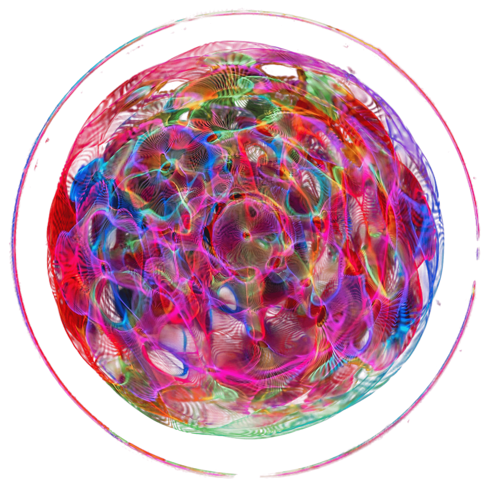

<div align="center">

<picture>
  <source media="(prefers-color-scheme: dark)" srcset="assets/logo.png">
  
</picture>

# WaterToGo

> **Convert JS/TS/Python/Rust codebases to idiomatic Go using Google Gemini.**

[](https://github.com/StellariumFoundation/WaterToGo/releases)
[](https://go.dev)
[](LICENSE)

</div>

---

## Features

- **One-shot conversion** — point at a project, get back idiomatic Go in a `0go0/` folder
- **Multi-language** — JavaScript, TypeScript, Python, Rust
- **Smart chunking** — large files are split into parts while keeping full context in the chat
- **Multi-key rotation** — enter any number of API keys; on failure it cycles through all keys instantly
- **Model fallback** — tries 12 Gemini models from most to least capable when all keys are exhausted
- **Retry on any error** — no waiting on dead keys or timeouts; immediately moves to the next working key
- **Gitignore-aware scanner** — respects `.gitignore`, skips `node_modules`, `.git`, and build artifacts
- **No file limit** — converts every code file in the project regardless of count or size
- **TUI with progress** — real-time progress bar, live logs, per-file status
- **Cross-platform** — Windows, Linux, macOS, x86_64 and ARM64

---

## Download

| Platform | Architecture | File | How to run |
|---|---|---|---|
| **Windows** | x86_64 | [`WaterToGo-x86_64.exe`](https://github.com/johnvictor/watertogo/releases/latest) | Double-click |
| **Windows** | ARM64 | [`WaterToGo-arm64.exe`](https://github.com/johnvictor/watertogo/releases/latest) | Double-click |
| **Linux** | x86_64 | [`WaterToGo-x86_64.AppImage`](https://github.com/johnvictor/watertogo/releases/latest) | `chmod +x` + double-click or `./` |
| **Linux** | ARM64 | [`WaterToGo-arm64.AppImage`](https://github.com/johnvictor/watertogo/releases/latest) | `chmod +x` + double-click or `./` |
| **macOS** | Intel | [`WaterToGo-darwin-x86_64.tar.gz`](https://github.com/johnvictor/watertogo/releases/latest) | Extract → double-click `WaterToGo.app` |
| **macOS** | Apple Silicon | [`WaterToGo-darwin-arm64.tar.gz`](https://github.com/johnvictor/watertogo/releases/latest) | Extract → double-click `WaterToGo.app` |

All releases include SHA256 checksums. Download the latest from the [Releases page](https://github.com/johnvictor/watertogo/releases).

---

## Quick start

**1. Get an API key**

Visit [Google AI Studio](https://aistudio.google.com/apikey) and create a free API key. You can use multiple keys — separate them with commas.

**2. Run WaterToGo**

| Platform | How |
|---|---|
| **Windows** | Double-click `WaterToGo-x86_64.exe` |
| **Linux** | `./WaterToGo-x86_64.AppImage` |
| **macOS** | Double-click `WaterToGo.app` |

**3. Enter your API key(s)**

Paste one or more comma-separated keys. If you've run it before, previously saved keys are available — press Enter to reuse them.

**4. Select a project folder**

Type the full path to the JS/TS/Python/Rust project you want to convert.

**5. Wait for conversion**

WaterToGo scans every code file and sends each one to Gemini for conversion. Progress is shown in real time. All output lands in a `0go0/` folder next to your project.

---

## How it works

```
Your Project/              0go0/
  src/                       src/
    app.js      ──►           app.go
    utils.ts                  utils.go
    models.py                 models.go
    lib.rs                    lib.go
  config.json  ──► (copied)  config.json
  logo.png     ──► (copied)  logo.png
```

1. **Scan** — recursively walks the source directory, respecting `.gitignore` and skipping `node_modules`, `.git`, `watertogo_config.json`, and build outputs
2. **Classify** — identifies code files (`.js`, `.ts`, `.py`, `.rs`) and non-code files (everything else)
3. **Convert** — each code file is sent to a Gemini chat session with a prompt requesting idiomatic Go; non-code files are copied as-is
4. **Chunk** — files that exceed the model's output token limit are split by lines, with the full source sent as context first, then converted part by part
5. **Write** — Go output is accumulated, cleaned, and written to the matching path under `0go0/`

### Key rotation & model fallback

When any API call fails (quota, auth, network, or anything else), WaterToGo immediately rotates to the next API key. If all keys are exhausted for a model, it advances through 12 Gemini models:

| Priority | Model |
|---|---|
| 1 | `gemini-pro-latest` |
| 2 | `gemini-3.1-pro-preview` |
| 3 | `gemini-flash-latest` |
| 4 | `gemini-3.5-flash` |
| 5 | `gemini-3-pro-preview` |
| 6 | `gemini-3-flash-preview` |
| 7 | `gemini-flash-lite-latest` |
| 8 | `gemini-3.1-flash-lite` |
| 9 | `gemini-3.1-flash-lite-preview` |
| 10 | `gemma-4-31b-it` |
| 11 | `gemini-2.5-pro` |
| 12 | `gemini-2.5-flash` |

---

## Build from source

```bash
git clone https://github.com/johnvictor/watertogo.git
cd watertogo
go build -o watertogo .
```

Requires **Go 1.26+**.

### Cross-compile

```bash
GOOS=linux   GOARCH=amd64 go build -ldflags="-s -w" -o watertogo-linux .
GOOS=windows GOARCH=amd64 go build -ldflags="-s -w" -o watertogo.exe .
GOOS=darwin  GOARCH=amd64 go build -ldflags="-s -w" -o watertogo-macos .
GOOS=darwin  GOARCH=arm64 go build -ldflags="-s -w" -o watertogo-macos-arm64 .
```

---

## Configuration

API keys are stored in a system config directory:

| Platform | Location |
|---|---|
| **Windows** | `%APPDATA%\WaterToGo\watertogo_config.json` |
| **Linux** | `~/.config/WaterToGo/watertogo_config.json` |
| **macOS** | `~/Library/Application Support/WaterToGo/watertogo_config.json` |

The file format:

```json
{
  "api_keys": ["key1", "key2", "key3"]
}
```

Old single-key format (`"api_key": "..."`) is supported and upgraded automatically on load.

All activity is logged to `watertogo.log` in the project root.

---

## Project structure

```
watertogo/
├── main.go              # Entry point
├── config/              # API key management
│   └── config.go
├── scanner/             # File system scanner with gitignore
│   └── scanner.go
├── converter/           # Gemini API chat session + conversion logic
│   └── converter.go
├── tui/                 # Bubble Tea TUI
│   ├── tui.go           # Model, screens, styles
│   ├── input.go         # API key & folder input handling
│   ├── update.go        # Update loop, conversion orchestration
│   ├── views.go         # Screen rendering
│   ├── messages.go      # Message types, retry logic
│   ├── log.go           # File logging
│   └── util.go          # Centering helpers
├── assets/
│   ├── logo.png         # Application logo
│   └── watertogo.desktop # Linux desktop entry
└── .github/workflows/
    └── release.yml      # CI/CD pipeline
```

---

## Why WaterToGo?

Migrating codebases between languages is tedious and error-prone. WaterToGo automates the grunt work — it doesn't just translate syntax, it asks Gemini to produce **idiomatic Go** that follows Go conventions, uses proper error handling, and leverages Go's standard library.

The TUI gives you full visibility into what's happening, which files succeeded or failed, and why. Multi-key rotation and model fallback mean you don't get stuck waiting for quota to reset.

---

## License

MIT — see [LICENSE](LICENSE).

WaterToGo is not affiliated with Google or Gemini. The Gemini API is a service provided by Google.
